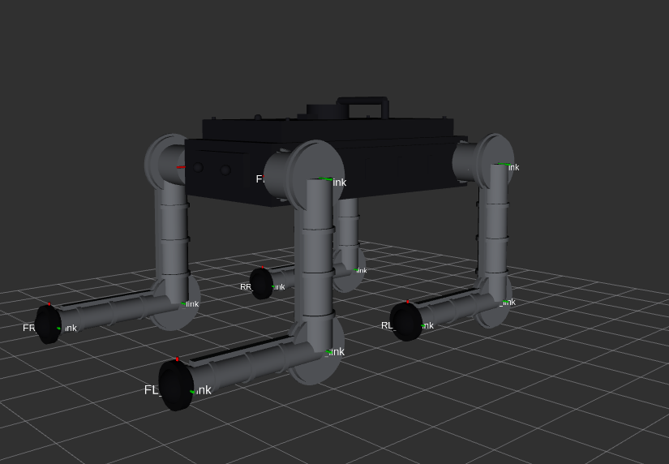
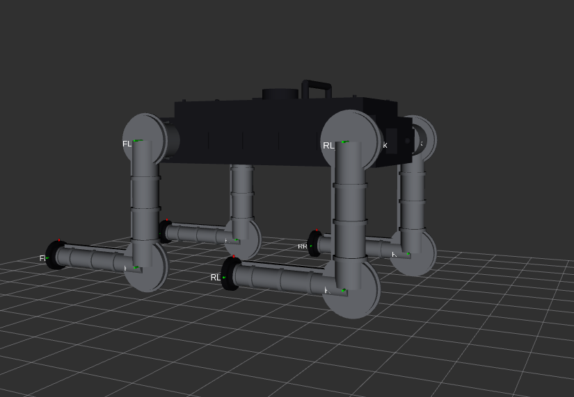
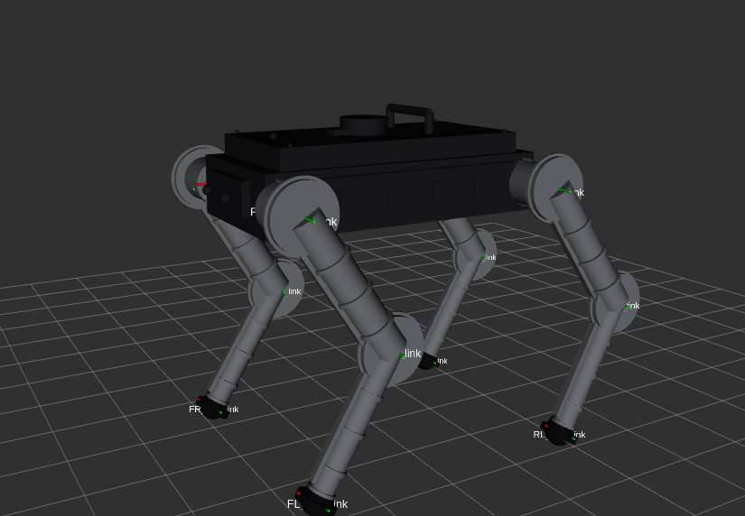

# Quadruped Robot

A 5 kg, 12-DOF quadruped robot built simulation-first using NVIDIA Isaac Lab.
The goal is full RL-trained locomotion in simulation before any hardware is touched.

## Design

The visual design layers cosmetic-only detail (chassis panels, vents, front camera
housing, roof-mounted lidar puck, carry handle, per-joint QDD pancake motor
housings, accent trim) onto the structural links, without touching any
`<collision>`/`<inertial>` geometry or the joint graph — kinematics, mass
distribution, and RL training behaviour are unaffected. Screenshots below are
from RViz2 (`ros2 launch quadruped_description display.launch.py`).

| | | |
|---|---|---|
|  |  |  |
| Relaxed stance, joint frames visible | Chassis detail — panels, vents, camera, handle | Standing pose — full 12-DOF leg kinematics |

## Robot Specification

| Parameter | Value |
|---|---|
| Body mass | ~5 kg total |
| DOF | 12 (3 per leg: hip abduction, thigh, knee) |
| Actuators | Quasi-Direct Drive (QDD) |
| Use case | Terrain inspection |
| High-level compute | Raspberry Pi 5 8 GB |
| Real-time compute | Teensy 4.1 @ 1 kHz |
| Depth sensor | Intel RealSense D435i |
| Foot contact | FSR sensors ×4 |

## Stack

| Layer | Tool |
|---|---|
| RL training | NVIDIA Isaac Lab main + RSL-RL / PPO |
| Physics sim | Isaac Sim (PhysX GPU) via `nvcr.io/nvidia/isaac-lab:2.3.2` |
| Visualisation | RViz2, TensorBoard |
| Middleware | ROS2 Jazzy |
| Language | Python 3.11 (Isaac Sim env) / 3.12 (host) |
| Dev tooling | Claude Code + MCP server |

## Repository Layout

```
config/
  robot_params.yaml          # single source of truth — all geometry, mass, joint limits

src/
  kinematics/
    leg.py                   # analytical FK + IK for a single 3-DOF leg
  simulation/
    isaac_lab/
      quadruped_env_cfg.py   # full ManagerBasedRLEnvCfg (scene, obs, rewards, events)
      agents/
        rsl_rl_ppo_cfg.py    # PPO hyperparameters (RSL-RL actor/critic split API)

assets/
  quadruped/
    quadruped.usd            # generated USD asset (output of convert_to_usd.sh)

scripts/
  generate_urdf.py           # reads robot_params.yaml → writes quadruped.urdf
  convert_to_usd.sh          # URDF → USD for Isaac Lab
  cloud_setup.sh             # one-shot RunPod container setup
  train_rl.py                # PPO training entry point
  play_rl.py                 # load checkpoint + run policy in viewer, or record a video
  watch_rl.py                # live MJPEG stream of the newest checkpoint (see below)

tests/
  unit/                      # pytest unit tests (no simulator required)
```

## Cloud Training (RunPod) — Recommended

Training runs on a RunPod RTX 3090 pod using the pre-built Isaac Lab container.

### 1. Create the pod

In RunPod, create a pod with:
- **Container image**: `nvcr.io/nvidia/isaac-lab:2.3.2`
- **GPU**: RTX 3090 (24 GB) or better
- **Expose HTTP ports**: `6006` (TensorBoard)
- **Disk**: 50 GB container disk

### 2. One-shot setup

SSH into the pod, then:

```bash
cd /workspace
git clone https://github.com/sanjaydinesh19/quadruped-robot.git Quadruped
cd Quadruped && bash scripts/cloud_setup.sh
```

This clones Isaac Lab, installs extensions, generates the URDF, and converts it to USD (~8 min total).

### 3. Train

```bash
/workspace/isaaclab/isaaclab.sh -p scripts/train_rl.py \
  --num_envs 2048 --headless
```

Checkpoints are saved every 200 iterations to `logs/rsl_rl/`.

### 4. Monitor with TensorBoard

In a second SSH session:

```bash
tensorboard --logdir /workspace/Quadruped/logs/rsl_rl \
  --port 6006 --bind_all
```

Access at `https://<pod-id>-6006.proxy.runpod.net`.

### 5. Resume training

```bash
/workspace/isaaclab/isaaclab.sh -p scripts/train_rl.py \
  --num_envs 2048 --headless --resume
```

### 6. Watch the policy live (recommended over recording per checkpoint)

Isaac Sim's native livestream needs a UDP media channel, and RunPod pods don't
forward UDP — the standard WebRTC livestream path will not connect on a
RunPod pod, no matter how the ports are configured. `scripts/watch_rl.py`
sidesteps that: it runs a 1-env rollout alongside training, auto-reloads the
newest checkpoint every 30 s, and streams frames as MJPEG over plain HTTP —
TCP only, so it works through the same port-proxy mechanism as TensorBoard.

In a third SSH session (alongside training and TensorBoard):

```bash
/workspace/isaaclab/isaaclab.sh -p scripts/watch_rl.py \
  --headless --enable_cameras --port 6007
```

Expose port `6007` the same way you exposed `6006` for TensorBoard, then open:

```
https://<pod-id>-6007.proxy.runpod.net/
```

The page shows the live rollout and jumps to each new checkpoint automatically
as training saves it — no manual record/rename/serve/download cycle needed.

### 7. Record and download a policy video

Still useful for saving a specific checkpoint's run rather than just watching live.

**Record** (replace `model_2800.pt` with any checkpoint):

```bash
/workspace/isaaclab/isaaclab.sh -p scripts/play_rl.py \
  --checkpoint /workspace/Quadruped/logs/rsl_rl/model_2800.pt \
  --num_envs 1 \
  --headless --video --video_length 500
```

Saves to `videos/play.mp4` (~2 min). Rename to keep track of the checkpoint:

```bash
mv /workspace/Quadruped/videos/play.mp4 /workspace/Quadruped/videos/model_2800.mp4
```

**Serve** (stop TensorBoard first if it is running on port 6006):

```bash
pkill -f tensorboard 2>/dev/null
cd /workspace/Quadruped/videos && \
  /workspace/isaaclab/_isaac_sim/kit/python/bin/python3 -m http.server 6006
```

**Download** — open in a browser:

```
https://<pod-id>-6006.proxy.runpod.net/model_2800.mp4
```

Right-click the video → **Save Video As**.

**Restore TensorBoard** when done (new SSH session or after Ctrl+C):

```bash
tensorboard --logdir /workspace/Quadruped/logs/rsl_rl --port 6006 --bind_all
```

---

## Local Development

### 1. Python dependencies (host tools only)

```bash
pip install -e ".[dev]"
pytest tests/unit/
```

### 2. Generate the URDF

Edit `config/robot_params.yaml` to change any physical parameter, then:

```bash
python scripts/generate_urdf.py
```

### 3. Visualise in RViz2

```bash
sudo apt install ros-jazzy-joint-state-publisher ros-jazzy-joint-state-publisher-gui
colcon build --packages-select quadruped_description --symlink-install
source install/setup.bash
ros2 launch quadruped_description display.launch.py
```

Use the joint slider GUI to manually drive all 12 joints.

---

## RL Environment

| Property | Value |
|---|---|
| Observation space | 48-dim (proprioceptive only) |
| Action space | 12-dim joint position offsets |
| Physics rate | 200 Hz |
| Policy rate | 50 Hz |
| Episode length | 20 s |
| Parallel envs | 32 (local) / 2048 (cloud RTX 3090) |

**Reward shaping:** primary objective is tracking commanded (vx, vy, ωz) velocity.
Penalties discourage bouncing, high energy use, thigh ground contacts, and falling.
`feet_air_time` rewards actual stepping and `feet_slide` penalises a planted foot
sliding — vendored in `src/simulation/isaac_lab/mdp/` since isaaclab 2.3.x's core
`mdp` module doesn't ship them (they're locomotion-task-specific upstream).

**Domain randomisation:** floor friction, base mass ±0.5 kg, random episode reset,
random pushes every 10–15 s.

---

## Status

| Component | State |
|---|---|
| Robot spec | Done |
| Parametric URDF | Done |
| FK / IK | Done, tested |
| RViz2 visualisation | Done |
| USD asset | Done |
| Isaac Lab env (flat terrain) | Done |
| RL training (flat terrain) | In progress |
| Rough terrain curriculum | Not started |
| ROS2 controllers | Not started |
| Hardware bring-up | Not started |
