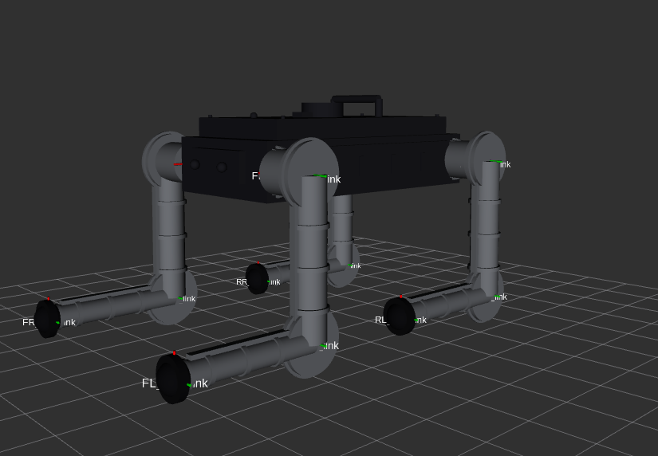
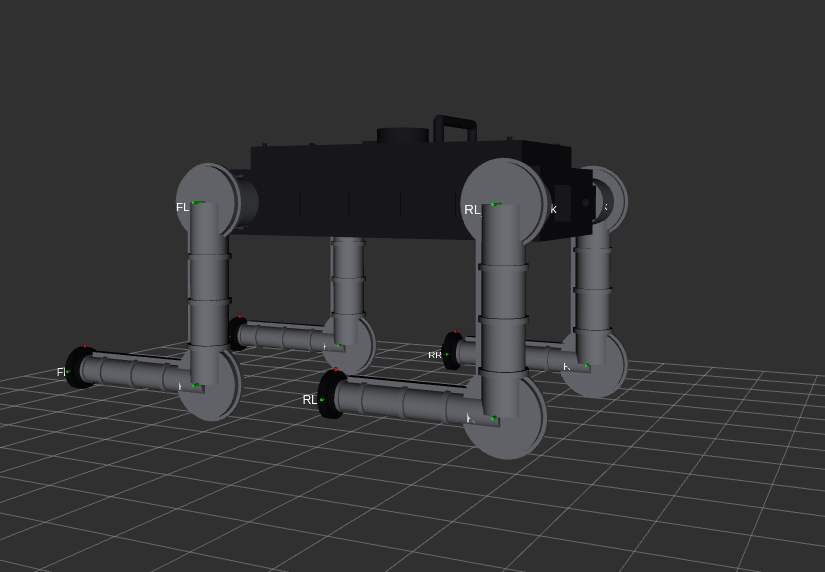
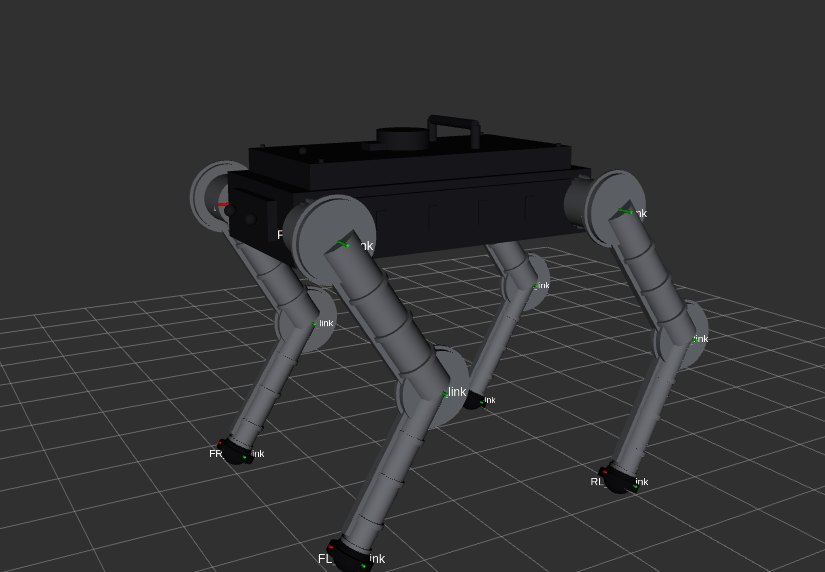

# Quadruped Robot

A 5 kg, 12-DOF quadruped robot built simulation-first using NVIDIA Isaac Lab.
The goal is full RL-trained locomotion in simulation before any hardware is touched.

## Design

The visual design layers cosmetic-only detail (chassis panels, vents, front camera
housing, roof-mounted lidar puck, carry handle, per-joint QDD pancake motor
housings, accent trim) onto the structural links, without touching any
`<collision>`/`<inertial>` geometry or the joint graph — kinematics, mass
distribution, and RL training behaviour are unaffected. Screenshots below are
from RViz2 (`ros2 launch quadruped_description display.launch.py`).

| | | |
|---|---|---|
|  |  |  |
| Relaxed stance, joint frames visible | Chassis detail — panels, vents, camera, handle | Standing pose — full 12-DOF leg kinematics |

## Robot Specification

| Parameter | Value |
|---|---|
| Body mass | ~5 kg total |
| DOF | 12 (3 per leg: hip abduction, thigh, knee) |
| Actuators | Quasi-Direct Drive (QDD) |
| Use case | Terrain inspection |
| High-level compute | Raspberry Pi 5 8 GB |
| Real-time compute | Teensy 4.1 @ 1 kHz |
| Depth sensor | Intel RealSense D435i |
| Foot contact | FSR sensors ×4 |

## Hardware Components & Estimated Budget (INR)

Rough, budget-conscious hobbyist-market estimates for a physical build — not vendor
quotes. Actual prices vary by supplier and import duties; treat this as a planning
range, not a BOM to check out with.

| Component | Qty | Est. Unit Price | Est. Subtotal | Notes |
|---|---|---|---|---|
| QDD actuator — hip (10 N·m): BLDC gimbal motor + AS5048A magnetic encoder + SimpleFOC-class driver | 4 | ₹1,800 | ₹7,200 | DIY closed-loop QDD, not a geared servo |
| QDD actuator — thigh/knee (20 N·m): larger BLDC motor + encoder + driver | 8 | ₹2,600 | ₹20,800 | Higher torque needs a bigger stator |
| Raspberry Pi 5 (8 GB) | 1 | ₹8,500 | ₹8,500 | High-level compute |
| Teensy 4.1 | 1 | ₹3,500 | ₹3,500 | Real-time joint control @ 1 kHz |
| IMU (BNO055, 9-DOF w/ onboard fusion) | 1 | ₹1,800 | ₹1,800 | Base orientation/angular velocity |
| FSR foot sensors | 4 | ₹300 | ₹1,200 | Foot contact sensing |
| Intel RealSense D435i | 1 | ₹28,000 | ₹28,000 | Optional for initial bring-up — see below |
| LiPo battery (4S, ~5000 mAh) | 1 | ₹3,500 | ₹3,500 | Sized for a ~5 kg robot |
| BMS + power distribution + 5V/3.3V regulators | 1 | ₹1,500 | ₹1,500 | |
| 3D-printed frame (filament) + fasteners/bearings | 1 | ₹4,000 | ₹4,000 | PETG/nylon recommended over PLA |
| Wiring, connectors, misc electronics | 1 | ₹1,500 | ₹1,500 | XT60/JST, heat shrink, standoffs |
| **Total** | | | **≈ ₹81,500** | |

**Keeping it cheap:**
- The RealSense D435i is by far the single biggest line item (~34% of the total) and isn't needed for basic locomotion bring-up — this project is proprioceptive-only in sim (see RL Environment below), so the depth camera only matters once perception/navigation work starts. Deferring it drops the build to **≈ ₹53,500**.
- The DIY gimbal-motor + encoder + driver route above is roughly 5-10x cheaper per joint than commercial QDD actuators (e.g. MyActuator RMD-X-class units run ₹15,000-30,000 *each*, which would put just the 12 actuators at ₹1.8-3.6 lakh) — at the cost of more assembly/tuning work.
- Printing the frame at home instead of using a print service is most of the savings in that line; a print farm/service would add ₹3,000-6,000.

## Stack

| Layer | Tool |
|---|---|
| RL training | NVIDIA Isaac Lab v2.3.2 (pinned, matches the container tag) + RSL-RL / PPO |
| Physics sim | Isaac Sim (PhysX GPU) via `nvcr.io/nvidia/isaac-lab:2.3.2` |
| Visualisation | RViz2, TensorBoard |
| Middleware | ROS2 Jazzy |
| Language | Python 3.11 (Isaac Sim env) / 3.12 (host) |
| Dev tooling | Claude Code + MCP server |

## Repository Layout

```
config/
  robot_params.yaml          # single source of truth — all geometry, mass, joint limits

src/
  kinematics/
    leg.py                   # analytical FK + IK for a single 3-DOF leg
  simulation/
    isaac_lab/
      quadruped_env_cfg.py   # full ManagerBasedRLEnvCfg (scene, obs, rewards, events)
      mdp/
        rewards.py            # feet_air_time + feet_slide, vendored from isaaclab_tasks
      agents/
        rsl_rl_ppo_cfg.py    # PPO hyperparameters (RSL-RL actor/critic split API)

assets/
  quadruped/
    quadruped.usd            # generated USD asset (output of convert_to_usd.sh)

scripts/
  generate_urdf.py           # reads robot_params.yaml → writes quadruped.urdf
  convert_to_usd.sh          # URDF → USD for Isaac Lab
  cloud_setup.sh             # one-shot RunPod container setup
  train_rl.py                # PPO training entry point
  play_rl.py                 # load checkpoint + run policy in viewer, or record a video
  watch_rl.py                # live MJPEG stream of the newest checkpoint (see below)

tests/
  unit/                      # pytest unit tests (no simulator required)
```

## Cloud Training (RunPod) — Recommended

Training runs on a RunPod RTX 3090 pod using the pre-built Isaac Lab container.

### 1. Create the pod

In RunPod, create a pod with:
- **Container image**: `nvcr.io/nvidia/isaac-lab:2.3.2`
- **GPU**: RTX 3090 (24 GB) or better
- **Expose HTTP ports**: `6006` (TensorBoard)
- **Disk**: 50 GB container disk

### 2. One-shot setup

SSH into the pod, then:

```bash
cd /workspace
git clone https://github.com/sanjaydinesh19/quadruped-robot.git Quadruped
cd Quadruped && bash scripts/cloud_setup.sh
```

This clones Isaac Lab, installs extensions, generates the URDF, and converts it to USD (~8 min total).

### 3. Train

```bash
/workspace/isaaclab/isaaclab.sh -p scripts/train_rl.py \
  --num_envs 2048 --headless
```

Checkpoints are saved every 200 iterations to `logs/rsl_rl/`.

### 4. Monitor with TensorBoard

In a second SSH session:

```bash
tensorboard --logdir /workspace/Quadruped/logs/rsl_rl \
  --port 6006 --bind_all
```

Access at `https://<pod-id>-6006.proxy.runpod.net`.

### 5. Resume training

```bash
/workspace/isaaclab/isaaclab.sh -p scripts/train_rl.py \
  --num_envs 2048 --headless --resume
```

### 6. Watch the policy live (recommended over recording per checkpoint)

Isaac Sim's native livestream needs a UDP media channel, and RunPod pods don't
forward UDP — the standard WebRTC livestream path will not connect on a
RunPod pod, no matter how the ports are configured. `scripts/watch_rl.py`
sidesteps that: it runs a 1-env rollout alongside training, auto-reloads the
newest checkpoint every 30 s, and streams frames as MJPEG over plain HTTP —
TCP only, so it works through the same port-proxy mechanism as TensorBoard.

In a third SSH session (alongside training and TensorBoard):

```bash
/workspace/isaaclab/isaaclab.sh -p scripts/watch_rl.py \
  --headless --enable_cameras --port 6007
```

Expose port `6007` the same way you exposed `6006` for TensorBoard, then open:

```
https://<pod-id>-6007.proxy.runpod.net/
```

The page shows the live rollout and jumps to each new checkpoint automatically
as training saves it — no manual record/rename/serve/download cycle needed.

### 7. Record and download a policy video

Still useful for saving a specific checkpoint's run rather than just watching live.

**Record** (replace `model_2800.pt` with any checkpoint):

```bash
/workspace/isaaclab/isaaclab.sh -p scripts/play_rl.py \
  --checkpoint /workspace/Quadruped/logs/rsl_rl/model_2800.pt \
  --num_envs 1 \
  --headless --video --video_length 500
```

Saves to `videos/play.mp4` (~2 min). Rename to keep track of the checkpoint:

```bash
mv /workspace/Quadruped/videos/play.mp4 /workspace/Quadruped/videos/model_2800.mp4
```

**Serve** (stop TensorBoard first if it is running on port 6006):

```bash
pkill -f tensorboard 2>/dev/null
cd /workspace/Quadruped/videos && \
  /workspace/isaaclab/_isaac_sim/kit/python/bin/python3 -m http.server 6006
```

**Download** — open in a browser:

```
https://<pod-id>-6006.proxy.runpod.net/model_2800.mp4
```

Right-click the video → **Save Video As**.

**Restore TensorBoard** when done (new SSH session or after Ctrl+C):

```bash
tensorboard --logdir /workspace/Quadruped/logs/rsl_rl --port 6006 --bind_all
```

---

## Local Development

### 1. Python dependencies (host tools only)

```bash
pip install -e ".[dev]"
pytest tests/unit/
```

### 2. Generate the URDF

Edit `config/robot_params.yaml` to change any physical parameter, then:

```bash
python scripts/generate_urdf.py
```

### 3. Visualise in RViz2

```bash
sudo apt install ros-jazzy-joint-state-publisher ros-jazzy-joint-state-publisher-gui
colcon build --packages-select quadruped_description --symlink-install
source install/setup.bash
ros2 launch quadruped_description display.launch.py
```

Use the joint slider GUI to manually drive all 12 joints.

---

## RL Environment

| Property | Value |
|---|---|
| Observation space | 48-dim (proprioceptive only) |
| Action space | 12-dim joint position offsets |
| Physics rate | 200 Hz |
| Policy rate | 50 Hz |
| Episode length | 20 s |
| Parallel envs | 32 (local) / 2048 (cloud RTX 3090) |

**Reward shaping:** primary objective is tracking commanded (vx, vy, ωz) velocity.
Penalties discourage bouncing, high energy use, thigh ground contacts, and falling.
`feet_air_time` rewards actual stepping and `feet_slide` penalises a planted foot
sliding — vendored in `src/simulation/isaac_lab/mdp/` since isaaclab 2.3.x's core
`mdp` module doesn't ship them (they're locomotion-task-specific upstream).

**Domain randomisation:** fixed reference friction (0.8 static / 0.6 dynamic), base
mass −0.35/+1.0 kg, random episode reset pose and velocity. As of V6 this matches the
reference Go2 flat task, which deliberately randomises *less* than V3–V5 did — COM
offset, joint-reset scaling, and periodic pushes are all disabled upstream and so are
disabled here. They belong back in for sim-to-real once a gait actually exists.

---

## Training Progress

**V3** (PPO, 4600 iterations, reward weights realigned to Go2/A1-class reference configs):

<video src="docs/videos/final_v3.mp4" controls width="480"></video>

The robot converged to a stable, collision-free stance — balancing entirely on its
feet with zero knee/thigh contact (`undesired_contacts = 0.0`) and tracking commanded
velocity reasonably well (`error_vel_xy ≈ 0.12`). It has **not** yet learned a true
stepping gait: `feet_air_time`/`feet_slide` stayed negative and flat for the whole run,
meaning the policy settled on a static/creeping solution rather than an alternating trot.

Root cause (full audit, corrected from the earlier "raise the weights" hypothesis —
V3 already raised `feet_air_time` 0.25 → 1.0 and it changed nothing):

1. ~~**`feet_air_time` taxed walking.**~~ **Later falsified — see V6.** The claim was
   that the 0.3 s threshold exceeded the ~0.2 s natural swing time, making every step
   net-negative. The reference config uses **0.5 s** with a small weight and produces a
   gait, so a high threshold is not what blocks stepping; this term is a mild regulariser
   everywhere it appears. Acting on this reading (V4 cut the threshold to 0.15 s and V3
   had already raised the weight to 1.0, 4× the reference) moved the config *away* from
   the working baseline.
2. **Commands were trackable without stepping.** With commands capped at ±0.5 m/s and
   the standard `exp(−err²/0.25)` kernel, a planted-feet creep tracks almost perfectly
   (even standing still keeps 37 % of tracking reward under the worst-case command).
   legged_gym / Isaac Lab pair that same kernel with ±1.0 m/s commands, where creeping
   physically cannot track — that pressure is what makes gait emerge there.
3. **Every gradient away from creeping was negative before it was positive** —
   transient `lin_vel_z`, orientation, action-rate penalties plus fall risk, against
   ~zero marginal tracking gain. A converged low-entropy PPO policy never crosses
   that valley.

**V4** (reward/command redesign — audited against Isaac Lab Go2/A1/ANYmal, legged_gym,
Walk These Ways, RMA):

| Change | V3 | V4 | Rationale |
|---|---|---|---|
| `feet_air_time.threshold` | 0.3 s | 0.15 s | Below natural swing time → every real step is net-positive; creeping still earns 0 |
| `lin_vel_x` command range | ±0.5 | ±1.0 | Creeping can't track 1 m/s → tracking itself demands stepping (reference range; speed scales with leg length, and legs are Go1-class) |
| `ang_vel_z` command range | ±0.5 | ±1.0 | Same pressure for turning in place |
| `joint_deviation_hip_l1` | — | −0.2 (hips, always-on) | Kills the splayed-stance creep posture; hips stay ~0 in a trot so it doesn't fight gait (WTW-style hip regularisation) |
| base COM randomisation | ±0.05 m xy | ±0.03 m xy | ±5 cm is 12.5 % of this body's length — over-hard DR that rewarded conservative wide stances |

Deliberately unchanged: all reward weights (already aligned to Go2/A1 flat references),
the 48-dim observation set, and the PPO hyperparameters (verbatim match to reference
flat-terrain configs — the bottomed-out adaptive LR was a symptom of convergence, not
a cause). No base-height penalty, foot-clearance reward, or gait/phase clock was added:
the first fights natural gait oscillation and the last two hard-code a specific gait.

**V5** (cross-checked against real open-source Isaac Lab quadruped repos — the official
[isaac-sim/IsaacLab](https://github.com/isaac-sim/IsaacLab) Go2/A1 flat & rough configs,
and [unitreerobotics/unitree_rl_lab](https://github.com/unitreerobotics/unitree_rl_lab),
Unitree's own actively-maintained IsaacLab RL repo for Go2/H1/G1 — fetched and read
directly rather than assumed, since V4's "already aligned to Go2/A1" claim for
`joint_torques_l2` turned out to be wrong by 8x once actually checked):

| Change | V4 | V5 | Rationale |
|---|---|---|---|
| `joint_torques_l2` | −2.5e-5 | −2.0e-4 | V4's comment claimed this matched Go2/A1; it didn't. Go2's real `rough_env_cfg.py` override *and* unitree_rl_lab's independent Go2 config both use −2e-4 (20x the generic default) — two unrelated real configs agree exactly. Also directly taxes near-zero-effort standing, the exact strategy the creep optimum exploits |
| `joint_vel_l2` | — | −0.001 | New term (unitree_rl_lab). Penalises sustained joint speed, not just its rate of change (`joint_acc_l2`'s job) |
| `dof_pos_limits` | — | −10.0 | New term (unitree_rl_lab; `isaaclab.envs.mdp.joint_pos_limits`, already available core-side). Cheap safety term, doesn't compete with gait shaping |
| `feet_air_time_variance` | — | −1.0 | New term, reconstructed from unitree_rl_lab's name+weight (exact source unavailable). Penalises uneven air time across the 4 feet — doesn't fix zero-stepping by itself (a creep's air times are all ~0, so variance is too), but once `feet_air_time` gets stepping started, this discourages an asymmetric single-leg shuffle in favour of synced diagonal-pair timing |
| Velocity-command **curriculum** | static ±1.0 range from iteration 0 | ramps ±0.3 → ±1.0 over iterations 300–1000 | Inspired by unitree_rl_lab's `lin_vel_cmd_levels`. A more principled fix than V4's static widening: full-width from the start either lets creeping track it (too narrow) or drowns a near-random early policy in an untrackable target (too wide, no exploration signal). Ramping gives early PPO an easy, learnable range, then raises the bar to the creep-defeating ±1.0 range only once basic locomotion competence exists. Implemented in `mdp/curriculums.py` |

Checked and confirmed already correct (no change): `track_lin_vel_xy_exp`/`track_ang_vel_z_exp`
(1.5/0.75 — exact match to Go2's real override, not just the ratio as V4 assumed),
`action_rate_l2`, `flat_orientation_l2`, `ang_vel_xy_l2`, `lin_vel_z_l2`, action `scale=0.25`,
`joint_acc_l2`, PPO hyperparameters and `[128,128,128]` network — all verified byte-for-byte
against Go2's actual configs, not re-derived from memory.

Deliberately **not** adopted: unitree_rl_lab's `action_rate_l2 = -0.1` (10x ours). V4's whole
direction was loosening restrictions that made standing still the safe default; a 10x jump on
action smoothness pulls the opposite way and risks re-suppressing the exploration needed to
find stepping at all — revisit only if V5 data shows action-rate cost isn't the bottleneck.
Also not adopted: unitree_rl_lab's `energy` term (torque×velocity power penalty, redundant
with the now-corrected `joint_torques_l2`) and its scaled (rather than gated) stand-still
penalty — both reasonable, but out of scope for one review pass; noted here for a future one.

**V5 result: trained ~1800 iterations on an RTX 4090, and the creep survived.** Tracking
stayed excellent (`track_lin_vel_xy_exp` ≈ 1.44/1.5, `error_vel_xy` ≈ 0.16) but
`feet_air_time` never went positive (−0.008 → −0.004) and `feet_air_time_variance` never
moved off ≈0 — no stepping, ever. The command curriculum did run correctly (it reached
full ±1.0 range at iteration ~1010, confirmed by `Curriculum/command_ranges = 1.0`), and
the policy did visibly react to the pressure — `error_vel_xy` spiked, action noise std
rose 0.10 → 0.19, `feet_slide` worsened by 70 %. But by iteration 1775 everything had
settled back: the policy absorbed the harder commands by **gliding faster**, not by
stepping. Run stopped early; the curriculum lever had been fully pulled with no reversal
in 765 iterations.

**V6** (stop inventing — port the reference verbatim):

Walking quadrupeds are a solved problem, so V6 discards the accumulated custom reasoning
and makes the config a faithful port of Isaac Lab's own **Go2 flat-terrain velocity task**
(`velocity_env_cfg.py` + `config/go2`, read at the **v2.3.2** tag this project pins),
cross-checked against `legged_gym`'s A1. Deviations from the reference now require a
geometry-based reason, written down at the point of deviation.

Reading the reference source falsified several things V3–V5 had asserted confidently:

| Thing | V3–V5 | Reference | What we got wrong |
|---|---|---|---|
| `feet_air_time.threshold` | 0.3 → **0.15** | **0.5** | V4 "root-caused" the creep to this threshold taxing walking and *lowered* it. The reference is **higher than the value V4 called the bug.** The whole V4 analysis was backwards |
| `feet_air_time.weight` | 1.0 | **0.25** | 4× too high. In every working config this is a mild regulariser — gait comes from velocity tracking, not from here |
| Floor friction | randomised **(0.4, 0.9)** | fixed **0.8 / 0.6** | The low end is an ice-rink. **The environment itself was subsidising the glide** — likely the single biggest enabler |
| Default stance | thigh 0.644, knee −1.345 (near-straight) | thigh **0.8**, calf **−1.5** (deep crouch) | Actions are ±0.25 rad offsets *from this pose*. From a straight-legged stance the robot **physically could not swing a leg**, whatever the reward said |
| `undesired_contacts` | thigh **+ shin** | thigh only (Go2: disabled) | Penalising shin contact discourages the deep flexion a gait needs |
| `soft_joint_pos_limit_factor` | never set (→1.0) | **0.9** | Made `dof_pos_limits` a near-no-op (logged ≈ −0.0001 all run) |
| Actuator model | `ImplicitActuatorCfg` | `DCMotorCfg` | Implicit PD gives full torque at any joint speed, making a rigid static creep unrealistically cheap to hold |
| Extra reward terms | `joint_deviation_hip_l1` (−0.2, always-on), `stand_still_joint_deviation_l1`, `feet_air_time_variance` (−1.0), `joint_vel_l2`, command curriculum | none of them exist | All invented or second-hand. The always-on hip penalty directly opposed the hip motion a gait needs. All removed |
| `lin_vel_y` command | ±0.5 | **±1.0** | Unjustified caution — the reference asks ±1.0 of Go2 and gets it |
| DR (COM, joint reset, pushes) | all enabled, aggressive | Go2 **disables all three** | The creep was never an under-exploration problem, so V4's "over-hard DR caused it" theory was also backwards |

Kept deliberately against the reference, both documented in-code: `undesired_contacts`
at −1.0 on thighs (Go2 disables it; this robot has previously exploited thigh-crawling)
and `feet_slide` at −0.1 (unitree_rl_lab's value — insurance against the known failure
mode, though restored friction should make it redundant). Unchanged and already correct:
the 48-dim observation set including noise magnitudes (verified an exact match), action
scale 0.25, tracking weights 1.5/0.75, `joint_torques_l2` −2e-4, timing (200 Hz physics /
50 Hz policy / 20 s episodes), and the PPO hyperparameters and `[128,128,128]` network.

V6 is code-complete and lint-clean but **not yet trained** — pending a RunPod run.

---

## Status

| Component | State |
|---|---|
| Robot spec | Done |
| Parametric URDF | Done |
| FK / IK | Done, tested |
| RViz2 visualisation | Done |
| USD asset | Done |
| Isaac Lab env (flat terrain) | Done |
| RL training (flat terrain) | V6 ready — V5 trained and still crept; config re-ported verbatim from Isaac Lab's Go2 flat task. Retraining pending |
| Rough terrain curriculum | Not started |
| ROS2 controllers | Not started |
| Hardware bring-up | Not started |
